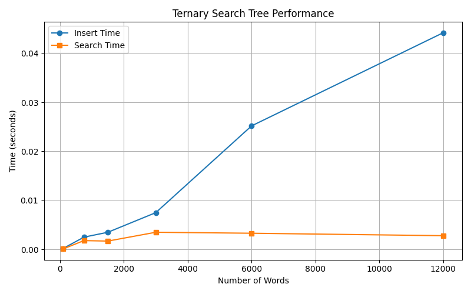

# Ternary Search Tree (TST) Project

This project implements a **Ternary Search Tree (TST)** in Python — a specialized data structure for efficient string storage and retrieval, combining properties of both binary search trees and tries. This implementation supports:

###  Functions

Insertion of strings (including the empty string)
Searching with prefix or exact match behavior
Counting and listing stored words
Pretty-printing the tree structure
Code benchmarking with performance plots
HPC execution via SLURM on KU Leuven Genius cluster

---

##  Project Structure

```
ternary-search-tree-project/
│
├── ternary_search_tree.py      # Main class implementation
├── benchmark_tst.py            # Benchmarking and performance evaluation script
├── data/search_trees/corncob_lowercase.txt       # Word list used for testing
├── benchmark_plot.png          # Saved plot of benchmark results
├── main_job.slurm              # SLURM job script for HPC execution
└── README.md                   # This file
```

---

##  Features

###  Insertion & Search

```python
tst.insert("apple")
tst.search("app")              # True (prefix)
tst.search("app", exact=True) # False
```

###  Empty String Support

- `search("")` returns `True` as it's a prefix of every string.
- `search("", exact=True)` returns `True` only if explicitly inserted.

###  Word Count & Listing

```python
len(tst)            # Total words inserted
tst.all_strings()   # List all inserted words
```

###  Visual Tree Output

```python
print(tst)
```

---
##  Benchmarking

To measure the performance of the TST implementation, run:

```bash
python benchmark_tst.py
```

This will:
- Benchmark insertion and search time for varying input sizes
- Display a summary table in the terminal
- Generate and save a performance plot as `benchmark_plot.png`

###  Performance Plot

The following chart shows insertion and search times for increasing input sizes:



---

##  HPC Execution (KU Leuven Genius Cluster)

This project was successfully executed on KU Leuven's Tier-2 HPC (Wice cluster) using the OnDemand platform.

###  Required Modules

```bash
module load cluster/genius/amd
module load matplotlib/3.1.1-foss-2019b-Python-3.7.4
```